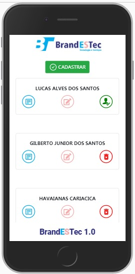
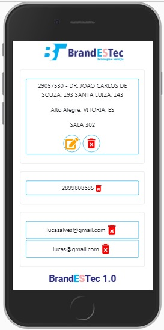
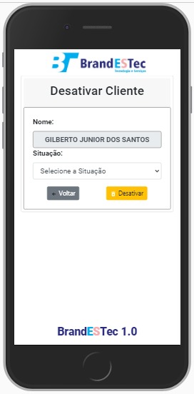
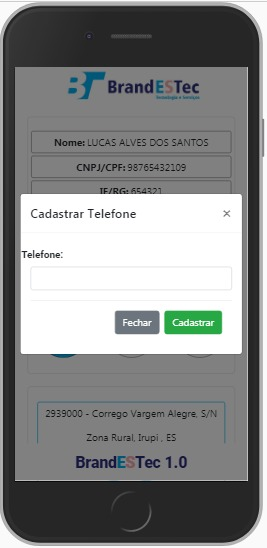
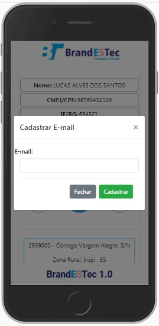
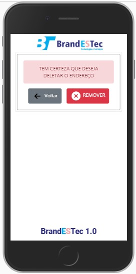
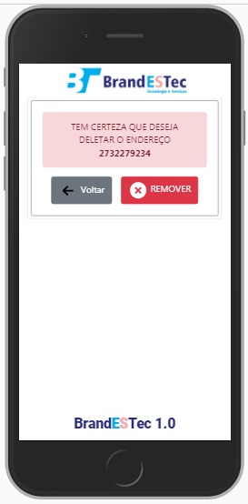
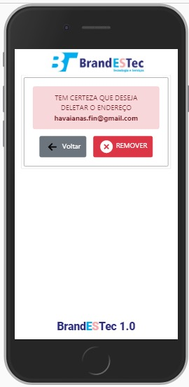

# Cadastro Cliente - BRANDESTEC

Sistema para cadastro de cliente. Back-End desenvolvido em `NODE JS`, e o Front-End desenvolvido em `REACT JS`.

1 - CADASTRO CLIENTE

        1.a – Cadastro de mais de 1 endereço.
        1.b - cadastro de mais de 1 telefone.
        1.c – cadastro de mais de e-mail

2 – ALTERAÇÃO CLIENTE
	
        2.a – Altera os dados do cliente – dados 
        pessoais. [ NOME, CPF/CNPJ, IE/RG, OBSERVAÇÃO]

3 – EXCLUIR CLIENTE
	
        3.a – O Sistema não exclui o cliente. Ele 
        desativa o cliente. Caso deseja pode ativar ele novamente.

4 – EXCLUSÃO
	
        4.a – O sistema exclui o telefone, e-mail e endereço. Caso o telefone, e-mail, 
        endereço foi colocado errado. Não tem como alterar, tem que excluir e cadastrar novamente.

---
# 📱 App
## Aplicação Desenvolvida em:
    React Js
    Bando de Dados: MySql
---
## Dependências Back-End: 

        cors: ^2.8.5,
        express: ^4.17.1,
        http-status: ^1.4.2,
        mysql2: ^2.1.0,
        sequelize": ^6.3.5

## Dependências Front-End: 

        cors: ^2.8.5,
        express: ^4.17.1,
        http-status: ^1.4.2,
        mysql2: ^2.1.0,
        sequelize": ^6.3.5        
---

---

# 📱 ScreenShot Aplicação

---
<h1 align="center">💻 Desenvolvido Por: Gilberto Júnior</h1>
